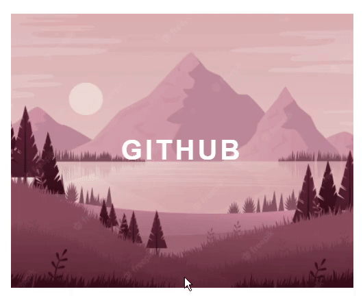
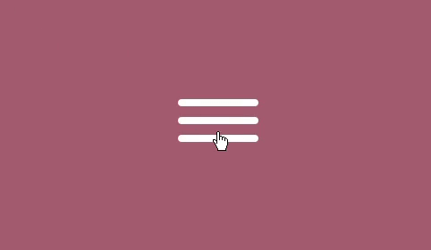

# desafio-html-css 👩🏻‍💻
Repositório para códigos desenvolvidos durante o desafio de HTML/CSS - DIO TQI

* [Parte 01 - Animação hover em card](#parte01)
* [Parte 02 - Animação menu hambúrguer](#parte02)
* [Parte 03 - Linear-gradient animado](#parte03)

##  Parte 01 - Animação hover em card 

##  Parte 02 - Animação menu hambúrguer 

##  Parte 03 - Linear-gradient animado 

